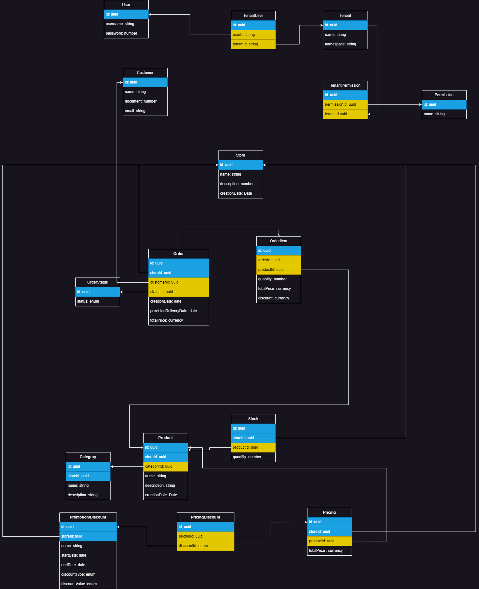

# Tech challenge - grupo 15

Projeto desenvolvido para pós graduação POSTECH - Software Architeture.

## Requisitos para executar o projeto

É necessário ter instalado na máquina [Docker](https://docs.docker.com/engine/install/) e [Docker Compose](https://docs.docker.com/compose/install/).

## Modelo Entidade Relacionamento



## Rodando o projeto

Para executar o projeto basta rodar o comando:

```
docker compose build
docker compose up
```

## Acessando o projeto

### Acesso a API

``` http://localhost:3000/api#/```

### Acesso ao prometheus

```http://localhost:9090```

### Acesso ao grafana

user: admin
senha: admin

```http://localhost:3001/d/PTSqcpJWk/nestjs-application-dashboard?orgId=1```

### Kubernetes

Antes de executar o ambiente, será necessário criar os namespaces utilizando os seguintes comandos:
```
kubectl create namespace api-tech-challenge
kubectl create namespace database-tech-challenge
kubectl create namespace monitoring-tech-challenge
```

Após isso, já será possível subir todos os recursos da aplicação:
```
kubectl apply -f k8s/api
kubectl apply -f k8s/database
kubectl apply -f k8s/prometheus
kubectl apply -f k8s/grafana
kubectl apply -f k8s/prometheus
kubectl apply -f k8s/roles
kubectl apply -f k8s/clusterRoles
kubectl apply -f k8s/volumes
kubectl apply -f k8s/components.yaml
```